# CBT/DBT RAG Assistant - Progress Summary (As of 2025-04-07)

This document summarizes the development progress, current structure, encountered issues, and potential next steps for the CBT/DBT RAG Assistant project.

## Progress So Far

We have successfully completed the foundational setup and core RAG pipeline implementation as outlined in Phases 0, 1, and 2 of the plan, plus the initial UI from Phase 3.

**Completed Phases/Steps:**

*   **Phase 0: Foundation & Setup**
    *   Project structure created.
    *   Poetry initialized, core dependencies added (`pydantic`, `python-dotenv`, `PyYAML`).
    *   Environment files (`.env`, `.env.example`, `.gitignore`) created.
    *   Docker Compose setup for PostgreSQL/pgvector (`rag_postgres`) and Ollama (`rag_ollama`) created and containers launched.
    *   Basic configuration loading (`config/settings.py`, `src/core/config.py`) implemented using `pydantic-settings`.
    *   Logging configuration file (`config/logging.yaml`) created (though loading it encountered issues, see below).
    *   Core data models (`Document`, `DocumentChunk` in `src/core/models/`) defined using Pydantic.
    *   Abstract Base Classes for core interfaces (`DataLoader`, `EmbeddingModel`, `LLM`, `VectorStore` in `src/core/interfaces/`) defined.
*   **Phase 1: Core Infrastructure & Ingestion**
    *   Dependencies added: `SQLAlchemy`, `psycopg2-binary`, `pgvector`, `pypdf2`, `langchain-text-splitters`.
    *   `PostgresVectorStore` implementation created (`src/infrastructure/vector_stores/`), connecting to the Dockerized DB, enabling the `vector` extension, creating the table, and implementing `add`/`query` methods using pgvector operators.
    *   `FileLoader` implementation created (`src/infrastructure/data_loaders/`) supporting `.txt` and `.pdf` files/directories.
    *   `SentenceTransformerEmbedder` implementation created (`src/infrastructure/embedding/`) using the configured sentence-transformer model.
    *   `IngestionService` created (`src/services/`) orchestrating loading, chunking, embedding, and storing.
    *   Ingestion script (`scripts/run_ingestion.py`) created using Typer and tested successfully with both empty and sample data directories.
*   **Phase 2: RAG Query Pipeline**
    *   Dependency added: `ollama`.
    *   `OllamaProvider` implementation created (`src/infrastructure/llm_providers/`) connecting to the Dockerized Ollama service.
    *   `QueryService` created (`src/services/`) orchestrating query embedding, chunk retrieval, prompt construction, and LLM generation.
    *   Query script (`scripts/run_query.py`) created using Typer and tested successfully (after pulling the required Ollama model).
*   **Phase 3: Application Interface (Partial)**
    *   Dependency added: `streamlit`.
    *   Basic Streamlit UI (`src/ui/app.py`) created, providing a chat interface to interact with the `QueryService`.
    *   Streamlit application successfully launched via `poetry run streamlit run src/ui/app.py`.

## High-Level File Structure Diagram

```mermaid
graph TD
    A[cbt_dbt_rag_assistant/] --> B[.env/.env.example];
    A --> C[pyproject.toml];
    A --> D[README.md];
    A --> E[PROGRESS_SUMMARY.md];
    A --> F[docker-compose.yml];
    A --> G[config/];
        G --> G1[settings.py];
        G --> G2[logging.yaml];
        G --> G3[...];
    A --> H[data/];
        H --> H1[raw/];
        H --> H2[processed/];
    A --> I[scripts/];
        I --> I1[run_ingestion.py];
        I --> I2[run_query.py];
    A --> J[src/];
        J --> K[core/];
            K --> K1[config.py];
            K --> K2[interfaces/];
                K2 --> K2a[data_loader.py];
                K2 --> K2b[embedding_model.py];
                K2 --> K2c[llm.py];
                K2 --> K2d[vector_store.py];
            K --> K3[models/];
                K3 --> K3a[document.py];
        J --> L[infrastructure/];
            L --> L1[data_loaders/];
                L1 --> L1a[file_loader.py];
            L --> L2[embedding/];
                L2 --> L2a[sentence_transformer_embedder.py];
            L --> L3[llm_providers/];
                L3 --> L3a[ollama_provider.py];
            L --> L4[vector_stores/];
                L4 --> L4a[postgres_vector_store.py];
        J --> M[services/];
            M --> M1[ingestion_service.py];
            M --> M2[query_service.py];
        J --> N[ui/];
            N --> N1[app.py];
        J --> O[utils/];
    A --> P[tests/];
    A --> Q[logs/];
    A --> R[docs/];

    style A fill:#f9f,stroke:#333,stroke-width:2px;
```

## Encountered Issues & Resolutions

1.  **Initial Command Chaining:** The `&&` operator for chaining commands failed in the PowerShell environment.
    *   **Resolution:** Switched to using semicolons (`;`) as command separators for PowerShell compatibility.
2.  **Poetry Not Found:** The `poetry` command was not recognized initially.
    *   **Resolution:** Installed Poetry using `pip install poetry` and added its script directory (`C:\Users\arvin\AppData\Roaming\Python\Python313\Scripts`) to the system PATH variable, followed by a system reboot to ensure the PATH update took effect.
3.  **`ModuleNotFoundError: No module named 'src'`:** Running scripts (`run_ingestion.py`) directly from the `scripts/` directory failed because the project root (containing `src/`) wasn't in Python's import path.
    *   **Attempt 1:** Tried `poetry install` to install the local project, but this failed due to missing `README.md` and then incorrect package structure assumptions by Poetry.
    *   **Attempt 2:** Modified `pyproject.toml` with `package-mode = false`. This didn't resolve the `poetry run` path issue.
    *   **Resolution:** Added code to the beginning of `run_ingestion.py` and `run_query.py` to manually calculate the project root directory and insert it into `sys.path`. This allows the scripts to find the `src` module.
4.  **SQLAlchemy Reserved Name:** Using `metadata` as a column name in the `ChunkModel` conflicted with SQLAlchemy's declarative API.
    *   **Resolution:** Renamed the column to `chunk_metadata` in the SQLAlchemy model (`src/infrastructure/vector_stores/postgres_vector_store.py`) and updated all references within that file.
5.  **`NameError: name 'init_empty_weights' is not defined`:** Error occurred during `SentenceTransformer` initialization, likely related to the underlying `transformers` library and missing `accelerate`.
    *   **Resolution:** Added the `accelerate` library using `poetry add accelerate`.
6.  **Ollama Model Not Found:** The `run_query.py` script failed because the specified LLM (`gemma:7b`) wasn't available in the Ollama Docker container.
    *   **Resolution:** Used `docker exec -it rag_ollama ollama pull gemma:7b` to download the model into the running container.
7.  **Logging Configuration Error (`'NoneType' object is not iterable`):** Persistent error when trying to load the logging configuration from `logging.yaml` using `logging.config.dictConfig`, even with checks in place. `yaml.safe_load` might be returning `None` or `dictConfig` is failing internally.
    *   **Current Status:** The script currently falls back to `logging.basicConfig` when the YAML loading fails, allowing the core functionality to proceed. Further investigation into the root cause of the `dictConfig` failure was deferred. The `stream: ext://sys.stdout` line was commented out in `logging.yaml` as part of troubleshooting, but didn't resolve the core issue.

## Potential Next Steps

Based on the original plan:

1.  **Phase 3: API Implementation:**
    *   Implement the FastAPI application (`src/api/`).
    *   Set up dependency injection for services (`src/api/dependencies.py`).
    *   Create API routers and endpoints (e.g., `/query`) (`src/api/routers/`).
    *   Define API request/response models (`src/core/models/` or a new `src/api/models/`).
    *   Write API tests (`tests/api/`).
    *   Update `Dockerfile` and `docker-compose.yml` to potentially run the API service.
2.  **Phase 4: Operationalization & Refinement:**
    *   **Testing:** Add more comprehensive unit and integration tests for all modules (`tests/`).
    *   **Logging:** Revisit the `logging.yaml` configuration issue if more advanced logging is required than `basicConfig` provides.
    *   **Error Handling:** Implement more specific custom exceptions (`src/core/exceptions.py`) and improve error feedback in the UI/API.
    *   **Documentation:** Flesh out `README.md`, add docstrings, potentially create ADRs for key decisions.
    *   **Refinement:**
        *   Experiment with different chunking strategies (`src/utils/text_processing.py`).
        *   Improve prompt engineering (make `DEFAULT_PROMPT_TEMPLATE` configurable).
        *   Evaluate different embedding models or LLMs (e.g., `gemma:4b`).
        *   Implement metadata filtering in `QueryService` and `PostgresVectorStore`.
        *   Add conversation history support to the `OllamaProvider` and `QueryService`.
